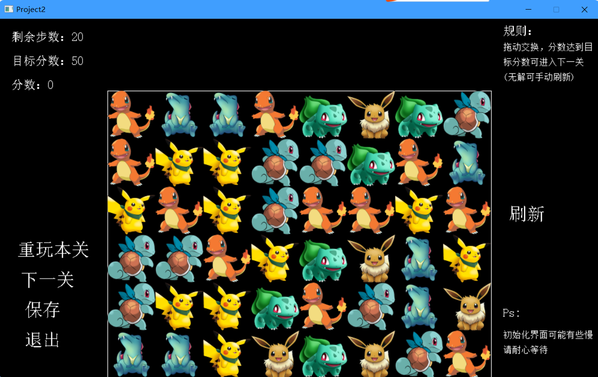

# xiaoxiaole
**宝可梦消消乐**
## 运行结果
- 开始界面

&nbsp;&nbsp;&nbsp;&nbsp;

- 第一关

&nbsp;&nbsp;&nbsp;&nbsp;

- 第二关

&nbsp;&nbsp;&nbsp;&nbsp;

- 特效
  - 横消除
 
     &nbsp;&nbsp;&nbsp;&nbsp;
     
  - 竖消除
  
     &nbsp;&nbsp;&nbsp;&nbsp;

## 环境
- Visual Studio 2019
- EasyX库
## 说明 
&nbsp;&nbsp;**此版本为最初版本，消除算法存在问题，用于应付编程作业。**
